# Project Title
Cthulhu Character Vault

## Overview

Cthulhu Character Vault is a place for Call of Cthulhu 7e players to create and store their character concepts.

### Problem

Having paper playing sheets can be inconvenient for players of Table Top Role Playing Games. Paper is not sturdy so often sheets get lost or damaged, especially when needing to be constantly erasing and updating Sanity and Luck points. There is also the problem of what to do if you arrive to the table and find you forgot your character sheet at home. As well, as many players of TT-RPGs have the "problem" of having so many ideas for characters but having nowhere or no time to play them. This Cthulhu Character Vault will help players by having a saved digital copy that can be referenced as well as give them a place to store all their ideas. 

### User Profile

Call of Cthulhu 7e Players:
-wanting a digital copy of their character sheet(s)
-wanting a place to keep track of all their character ideas

### Features

- As a user, I want to be able to create an account to make character sheets
- As a user, I want to be able to login to my account to make character sheets

- As a logged in user, I want to be able to create a new character sheet for the Call of Cthulhu 7e TTRPG
- As a logged in user, I want to be able to see my character vault and it display a list of all the characters I have made to date
- As a logged in user, I want to be able to see the details of a character in my vault
- As a logged in user, I want to be able to update the details of my character sheets
- As a logged in user, I want to be able to delete my character sheets that I no longer want to keep


## Implementation

### Tech Stack

- React
- JavaScript
- MySQL
- Express
- Client libraries: 
    - react
    - react-router
    - axios
- Server libraries:
    - knex
    - express
    - uuid

### APIs

- No external APIs will be used for the first sprint

### Sitemap

List the pages of your app with brief descriptions. You can show this visually, or write it out.

- Home page
- List characters 
    - (with delete option that does not require new page)
- View character
- Add character
- Edit character
- Register
- Login

### Mockups

- Website mockups can be seen [here](https://excalidraw.com/#json=MXN65C4-Uzili1IYZQCzE,vSOA3uaeYO-W5h961yS5EA)

- Home Page
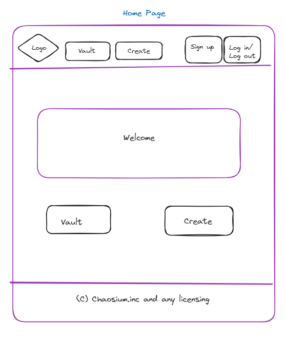

- Lists Page
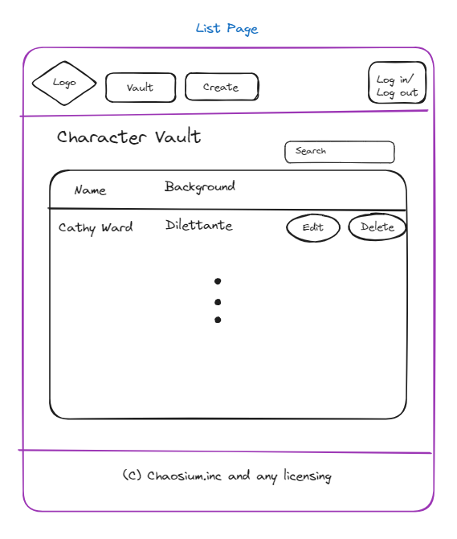

- Add Page
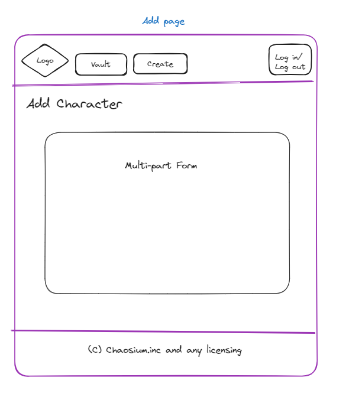

- Form States: 
    - State 1(investigator):
    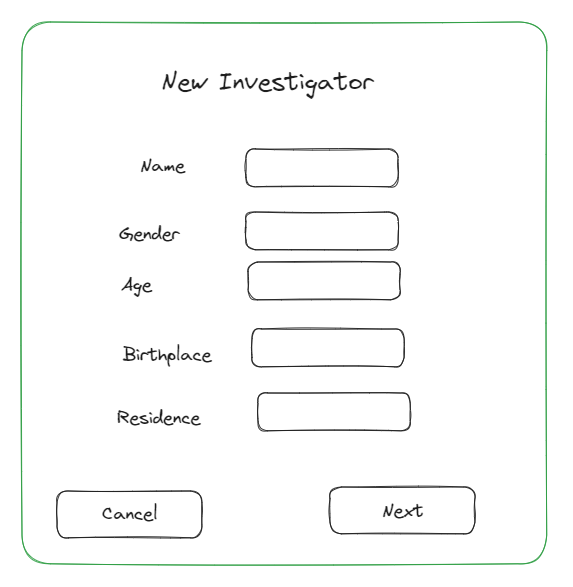
    - State 2(stats):
    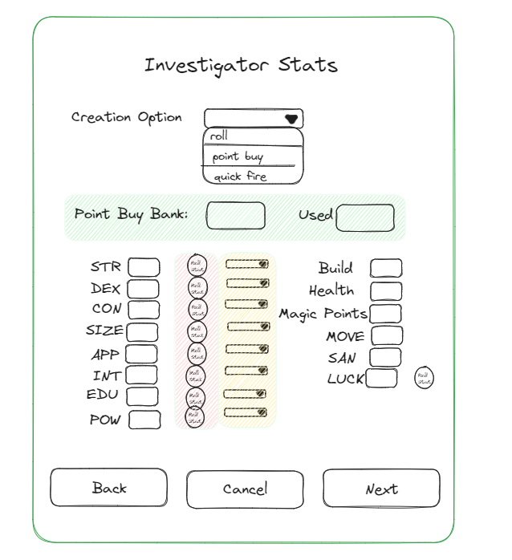
    - State 3(background):
    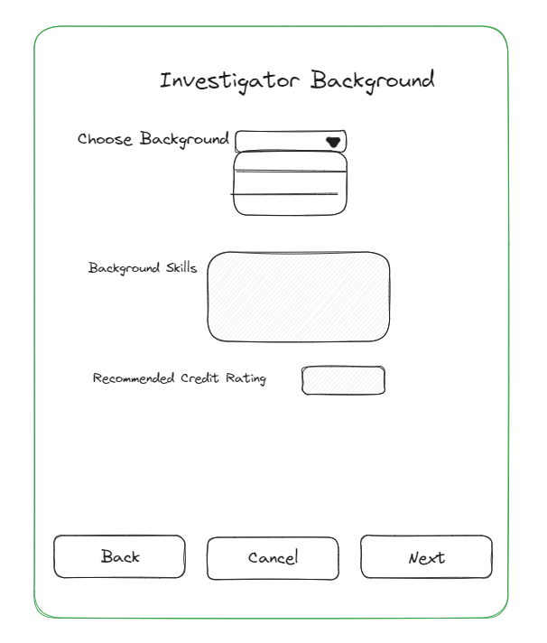
    - State 4(skills):
    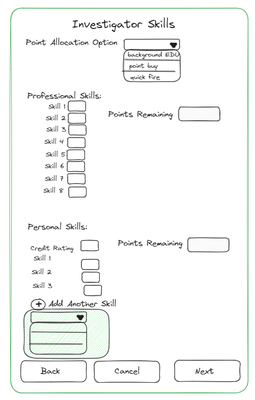
    - State 5(extra details):
    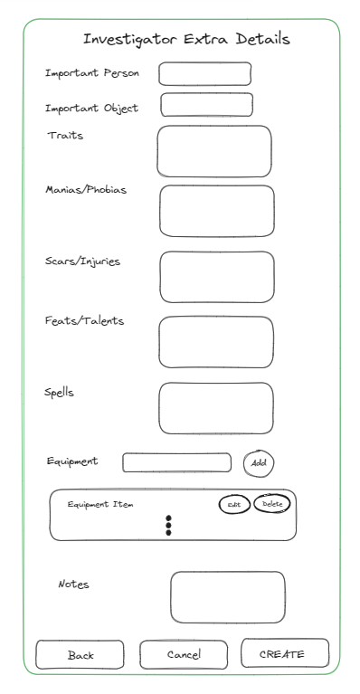

- View Page
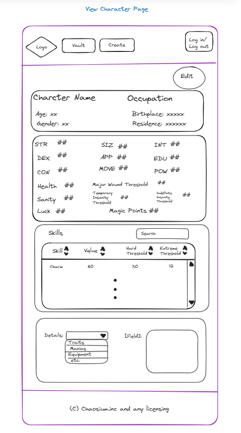

- Edit Page
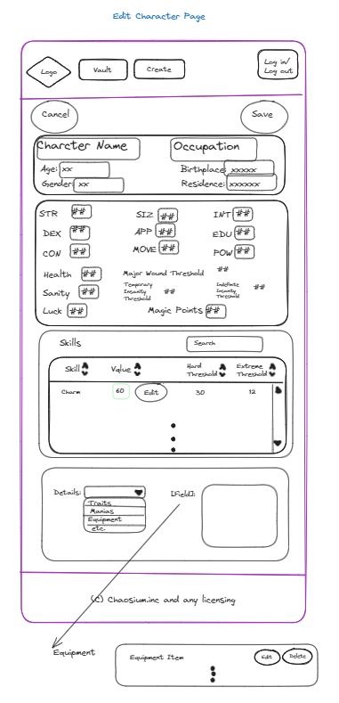

- Sign Up Page
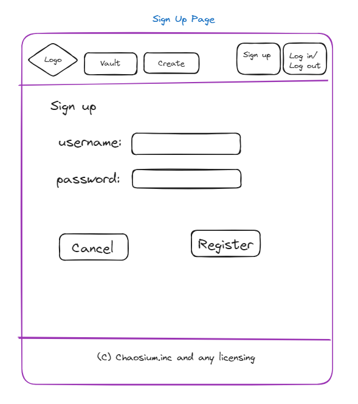

- Log In Page
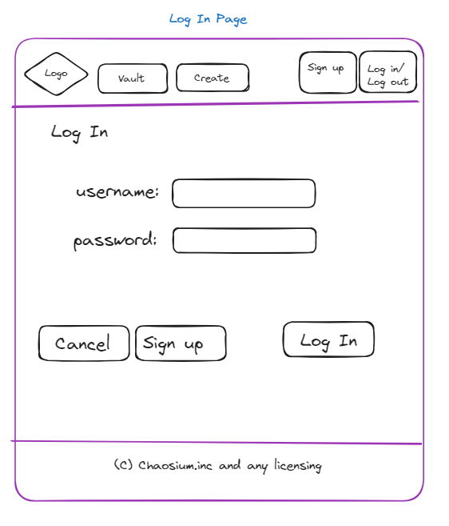

### Data

- Database design can be seen [here](https://drawsql.app/teams/myteam-885/diagrams/cthulhu-character-vault/embed)
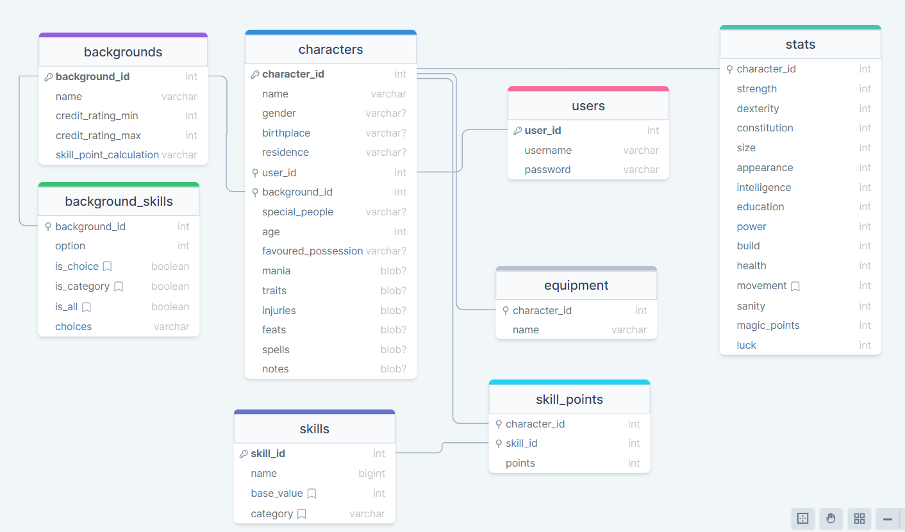

### Endpoints

List endpoints that your server will implement, including HTTP methods, parameters, and example responses.

**GET /characters**

- Get a user's characters

Parameters:
- user_id: user's id
- token: JWT used to verify user


Response:
```
[
    {
        "character_id": 1,
        "name": "Cathy Ward",
        "background": "Dilettante"
    },
    ...
]
```

**GET /characters/:id**

- Get character by id

Parameters:
- character_id: character's id as number
- token:  JWT used to verify user

Response:
```
{
    "character_id": 1,
    "name": "Cathy Ward",
    "gender": "female",
    "age":, 25,
    "birthplace": "Arkham",
    "residence": "Arkham",
    "special_people": "grandfather",
    "favoured_possession", "pocket watch",
    "background": "Dilettante",
    "mania": "arachnaphobia",
    "traits": "auburn hair, green eyes, short",
    "injuries": "",
    "feats": "",
    "notes": "",
    "background": "Dilettante",
    "stats": {               
                "strength": 50,
                "dexterity": 60,
                "consitution": 50,
                "size": 40,
                "appearance": 80,
                "intelligence": 60,
                "education": 70,
                "power": 70,
                "build": 1,
                "health": 7,
                "movement": 60,
                "sanity": 70,
                "magic_points": 10,
                "luck": 50
            }
    "skills": [
                {
                    "skill_id": 6,
                    "value": 60
                }, ...
            ],
    "equipment": [
                {
                    "name": "match book"
                }, ...
            ],

}
```

**POST /characters/**

- Logged in user can add a new character

Parameters:
- user_id: user's id
- token: JWT of the logged in user
- character: object containing character data

Response:
```
{
    "character_id": 1,
    "name": "Cathy Ward",
    "gender": "female",
    "age":, 25,
    "birthplace": "Arkham",
    "residence": "Arkham",
    "special_people": "grandfather",
    "favoured_possession", "pocket watch",
    "background": "Dilettante",
    "mania": "arachnaphobia",
    "traits": "auburn hair, green eyes, short",
    "injuries": "",
    "feats": "",
    "notes": "",
    "background": "Dilettante",
    "stats": {               
                "strength": 50,
                "dexterity": 60,
                "consitution": 50,
                "size": 40,
                "appearance": 80,
                "intelligence": 60,
                "education": 70,
                "power": 70,
                "build": 1,
                "health": 7,
                "movement": 60,
                "sanity": 70,
                "magic_points": 10,
                "luck": 50
            }
    "skills": [
                {
                    "skill_id": 6,
                    "value": 60
                }, ...
            ],
    "equipment": [
                {
                    "name": "match book"
                }, ...
            ],

}
```

**POST /characters/:id**

- Logged in user can update a given character sheet

Parameters:
- user_id: user's id
- character_id: character id
- token: JWT of the logged in user
- rating: Number Rating out of 5 in 0.5 increments

Response:
```
{
    "character_id": 1,
    "name": "Cathy Ward",
    "gender": "female",
    "age":, 25,
    "birthplace": "Arkham",
    "residence": "Arkham",
    "special_people": "grandfather",
    "favoured_possession", "pocket watch",
    "background": "Dilettante",
    "mania": "arachnaphobia",
    "traits": "auburn hair, green eyes, short",
    "injuries": "",
    "feats": "",
    "notes": "",
    "background": "Dilettante",
    "stats": {               
                "strength": 50,
                "dexterity": 60,
                "consitution": 50,
                "size": 40,
                "appearance": 80,
                "intelligence": 60,
                "education": 70,
                "power": 70,
                "build": 1,
                "health": 7,
                "movement": 60,
                "sanity": 70,
                "magic_points": 10,
                "luck": 50
            }
    "skills": [
                {
                    "skill_id": 6,
                    "value": 60
                }, ...
            ],
    "equipment": [
                {
                    "name": "match book"
                }, ...
            ],

}
```

**POST /users/register**

- Add a user account

Parameters:

- username: User's chosen username
- password: User's provided password

Response:
```
{
    "token": "seyJhbGciOiJIUzI1NiIsInR5cCI6IkpXVCJ9.eyJzdWIiOiIxMjM0NTY3ODkwIiwibmFtZSI6I..."
}
```

**POST /users/login**

- Login a user

Parameters:
- username: User's chosen username
- password: User's provided password

Response:
```
{
    "token": "seyJhbGciOiJIUzI1NiIsInR5cCI6IkpXVCJ9.eyJzdWIiOiIxMjM0NTY3ODkwIiwibmFtZSI6I..."
}
```

### Auth

- JWT auth
    - Before adding auth, all API requests will be using a fake user with id 1
    - Added after core features have first been implemented
    - Store JWT in localStorage, remove when a user logs out
    - Add states for logged in showing different UI in places listed in mockups

## Roadmap

- Create client
    - react project with routes and boilerplate pages

- Create server
    - express project with routing, with placeholder 200 responses

- Gather list of open licence material that users will be able to select as details for their character

- Create databases (migrations)

- Create seeds with sample character sheet data

- Deploy client and server projects so all commits will be reflected in production

- Feature: Home page
    - Place to link to List Page, Add Page, and Sign-up/Login

- Feature: List of user's characters
    - Implement list of characters page 
    - Create GET /character_sheets endpoint

- Feature: View Character
    - Implement view character sheet page
    - Create GET /character_sheets/:id endpoint

- Feature: Add Character
    - Add form input to create a new character page
    - Create POST /character_sheets endpoint
    - Create GET /professions endpoint
    - Create GET /skills endpoint

- Feature: Edit character
    - Add form input to edit a character sheet
    - Create PATCH /character_sheets/:id endpoint
    - States for add & update ratings 

- Feature: Delete Charcter
    - Add Delete button on character list items in List Page 
    - Create DELETE /character_sheets/:id endpoint

- Feature: Create account
    - Implement register page + form
    - Create POST /users/register endpoint

- Feature: Login
    - Implement login page + form
    - Create POST /users/login endpoint

- Feature: Implement JWT tokens
    - Server: Update expected requests / responses on protected endpoints
    - Client: Store JWT in local storage, include JWT on axios calls

- Bug fixes

- DEMO DAY

## Nice-to-haves

- Ability to export a PDF of the character sheet
- Ability to upload a photo to use as the investigator's portrait
- Forgot password functionality
- Add option for age-based stat modifiers
- Ability to make a randomly generatred character
- Ability to connect with other users to share and view each other's character sheets
    - Friends can see full list
    - Table groups only see characters that are in the same game table
- Styling dynamic page background using NASA's Picture of the Day API to have a changing starry backdrop
- Information page for non-logged in users that describes different parts of the character sheet's detais (ie. what the chracter stats represent)
- Logged in user can add custom details to have for their character (ie. backgrounds that they make rather than offical rule's backgrounds)
- Dark Mode
- Alternate Language Support (ie. FR or DE)
- Include rolling stat ability
- Be able to link it to a VTT to roll cross-platform (eg. like the Beyond20 Google extention)
